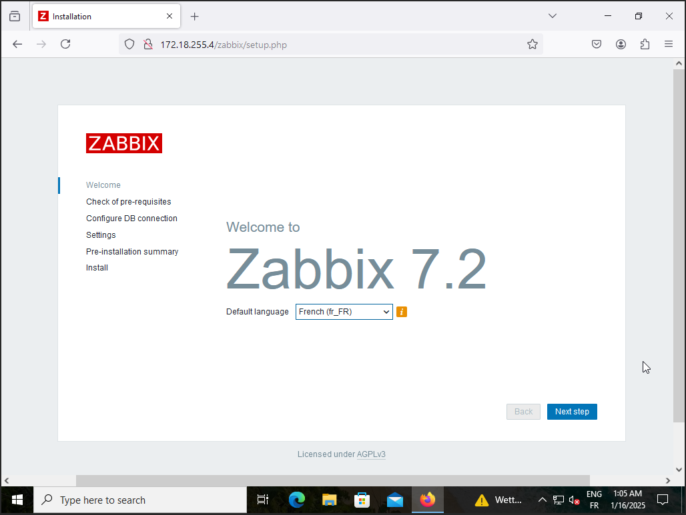
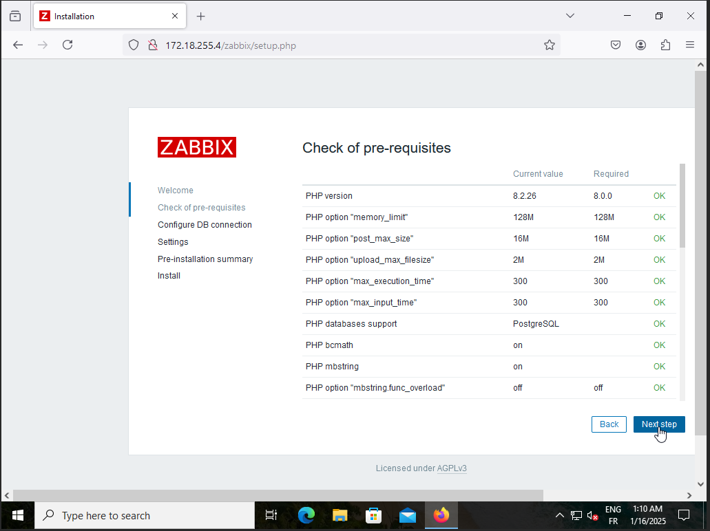
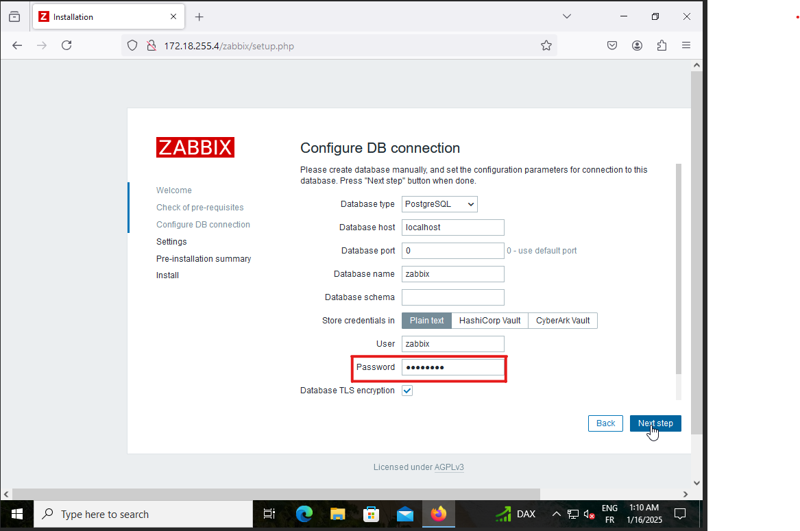
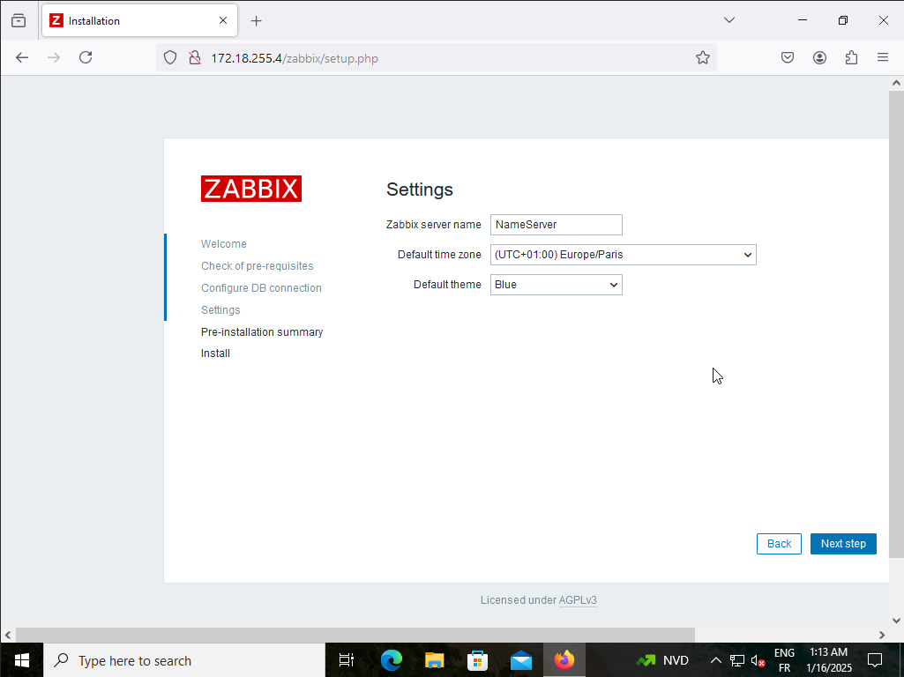
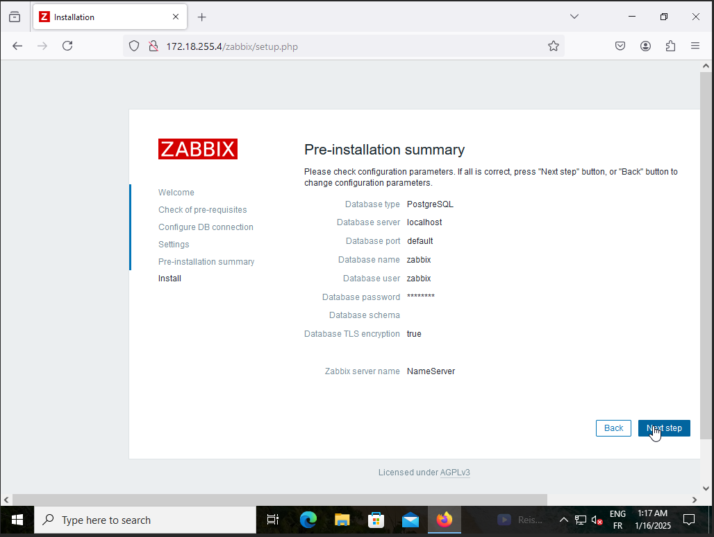
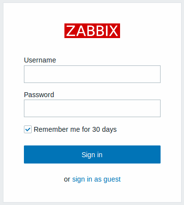

==============================

# P3-G1 BILLU

==============================

## Installation Serveur Debian12

## Configuration Réseau

| **Réseau 172.18.0.0/24** | \*\*\*\* | \*\*\*\* | \*\*\*\* |
| ------------------------ | -------- | -------- | -------- |
| **172.18.**              |          |          |          |
| \*\*\*\*                 |          |          |          |
| \*\*\*\*                 |          |          |          |

<details>

### les différentes VM seront installées sur ProxMox

### Pour l'installation de la VM Debian12 :
- Cliquez sur "Create VM" dans le menu supérieur

  - Donnez un nom à votre VM (VM-SRV-01)
  - sélectionnez "Linux" comme type de système d'exploitation.
  - Sélectionnez le stockage local et choisissez l'ISO Debian que vous avez téléchargé.
  - Configurez les paramètres de la VM selon vos besoins
  - CPU
  - RAM
  - disque
  - cliquez sur "OK" pour la validation

    ### Configuration

- Cliquez sur "install "  
 <P ALIGN="center"></P> 

 - On choisie la langue pour faire l'installation
 <P ALIGN="center"></P> 
- On établit le nom d'hôte
 <P ALIGN="center"></P> 
- On désigne également un nom de domaine.
 <P ALIGN="center"></P>  
- On définie un mot de passe
 <P ALIGN="center"></P> 
- On définie le nom de l'utilisateur
 <P ALIGN="center"></P> 
- puis on rajoute un mot de pass
 <P ALIGN="center"></P> 

- On partitionne notre disque selon nous besoin.
 <P ALIGN="center"></P> 

- Nous continuons à valider jusqu'à ce qu'il nous demande de configurer la gestion de packages, et à ce moment-là, nous l'acceptons et choisissons cette option.
  deb.debian.org
 <P ALIGN="center"></P>
  -Nous continuons la validation jusqu'à ce qu'il nous demande de paramétrer l'environnement de bureau de notre machine, et nous faisons notre choix selon nos
  besoins.
 <P ALIGN="center"></P>
-Nous continuons la validation avec l'installation du programme GRUB 
<P ALIGN="center"></P>
-Et normalement, on a juste à attendre la fin de l'installation pour ensuite accéder à notre machine Debian. 
<P ALIGN="center"></P>
<P ALIGN="center"></P>

</details>
<HR>

- ## Configuration SSH sur Debian

<details>

1.  Ouvrir le terminal et tapez la commande :

```bash
sudo apt update
```

-2. **Installer le serveur SSH :**

```bash
sudo apt install openssh-server
```

-3 **Assurez-vous que le service SSH démarre au démarrage et qu'il est actuellement actif :**

```bash
sudo systemctl enable ssh
```

```bash
sudo systemctl start ssh

```

-4. **Vérifier que le service SSH est en cours d'exécution :**

```bash
sudo systemctl status ssh
```

Si le service n'est pas actif
démarrez-le avec :

```bash
sudo systemctl start ssh
```

-Et normalement vous aller avoir ce résultat -

- ## Configuration SSH sur Windows server
- Ouvrir les Paramètres :

-1. Cliquez sur le bouton Démarrer et sélectionnez "Paramètres" (ou appuyez sur Win + I) Dans les Paramètres, allez dans "Applications"

-2. Sélectionnez "Fonctionnalités facultatives" Cliquez sur "Ajouter une fonctionnalité facultative"

-3. Rechercher et installer OpenSSH Client : Cochez la case à côté de "OpenSSH Client" et cliquez sur "Installer"

-4. Redémarrer votre ordinateur : Redémarrez pour que les modifications prennent effet

-5. Connexion via PowerShell : Lancez PowerShell avec les privilèges administratifs (clic droit sur l'icône PowerShell, puis "Exécuter en tant qu'administrateur").
pui Utilisez la commande suivante pour vous connecter à votre serveur Debian

```bash
 ssh user@server_ip
```

Remplacez user par votre nom d'utilisateur Debian et server_ip par l'adresse IP de votre serveur Debian , puis vous Saisissez le mot de passe de votre
utilisateur Debian lorsque vous y êtes invité.

</details>

##

# Mise en place d'un serveur de supervision - Zabbix
Notre serveur de supervision sera installé avec une VM Debian 12.8.

## Pré requis de la machine   
- Nom de la machine : `Spiderman`  
- Adresse IP : `172.18.255.4`  
- DNS : `172.18.255.1`  
- Gateway : `172.18.255.254`  
- Domaine : `billu.com`  

## Installation de Zebbix sur la machine  

### 1 - Installation des dépendances.  

Effectuez la commande `apt install sudo gpg curl wget`  

### 2 - Installation de PostgreSQL   

Installer dabord les dépôts PostgreSQL et désactiver les dépôts PostgreSQL système par défaut. Lorsque le message suivant apparaît : _« Ce script activera le dépôt APT PostgreSQL sur apt.postgresql.org sur votre système. Le nom de code de la distribution utilisé sera bookworm-pgdg. »_ appuyez sur **Entrée** pour continuer et confirmer l'installation depuis le dépôt officiel.  

Utilisez les commandes suivantes :  
`apt install -y postgresql-common`  
`/usr/share/postgresql-common/pgdg/apt.postgresql.org.sh`  

Installer ensuite la dernière version de PostgreSQL (version 17)  
`apt -y install postgresql-17`  

Lancer PostgreSQL et configurer le pour qu'il démarre automatiquement lors du démarrage du système  
`systemctl enable postgresql --now`  

### 3 - Installation du serveur Zabbix et des composants

Une fois la base données installée, procéder à l'installation du serveur Zabbix et de tous ses composants.

Ajouter les dépôts Zabbix et vidons le cache d'installation. 

```bash
root@spiderman:~# wget https://repo.zabbix.com/zabbix/7.2/release/debian/pool/main/z/zabbix-release/zabbix-release_latest_7.2+debian12_all.deb
root@spiderman:~# dpkg -i zabbix-release_latest_7.2+debian12_all.deb
root@spiderman:~# apt update
```

Nous installons tous les composants nécessaires de Zabbix.

Dans ce cas, nous utiliserons Zabbix Agent 2 comme agent principal de supervision, recommandé pour ses nombreuses fonctionnalités supplémentaires.  
`apt install zabbix-server-pgsql zabbix-frontend-php php8.2-pgsql zabbix-apache-conf zabbix-sql-scripts zabbix-agent2 zabbix-web-service`  

### 4 - Initialisation de la base de données

Commencez par créer un utilisateur de base de données pour Zabbix. Pendant le processus, un mot de passe d'accès sera demandé. Ensuite, créez une base de données vide et attribuez les autorisations nécessaires.  

`sudo -u postgres createuser --pwprompt zabbix`  
`sudo -u postgres createdb -O zabbix zabbix`  

À ce stade, nous pouvons importer le schéma et les données par défaut. Le mot de passe saisi précédemment sera de nouveau demandé.  
`zcat /usr/share/zabbix/sql-scripts/postgresql/server.sql.gz | sudo -u zabbix psql zabbix`

### 5 - Configuration du Serveur Zabbix

Ouvrez le fichier de configuration du serveur Zabbix.
`nano /etc/zabbix/zabbix_server.conf`  
Attention il est fortement recommendait de faire un backup du fichier avant modification ( `cp zabbix_server.conf zabbix_server.conf.backup` par exemple)

Modifiez les paramètres suivants comme indiqué ci-dessous :  
```bash
...
DBPassword=motdepasse
StartReportWriters=1
WebServiceURL=http://localhost:10053/report
...
```

Configurez les packages linguistiques pour l'interface de Zabbix :  
```bash
sed -i '/# fr_FR.UTF-8 UTF-8/s/^# //' /etc/locale.gen
sed -i '/# en_US.UTF-8 UTF-8/s/^# //' /etc/locale.gen
locale-gen
```

Redémarrez les services liés et configurez-les pour un démarrage automatique :  
```bash
systemctl restart zabbix-server zabbix-web-service zabbix-agent2 apache2
systemctl enable zabbix-server zabbix-web-service zabbix-agent2 apache2
```

### 6 - Configuration de l'Interface de Zabbix

Depuis un poste administrateur, accédez à l'URL où Zabbix est en cours d'exécution, par exmple dans notre cas http://172.18.255.4/zabbix 

Suivez l'assistant d'installation initiale pour configurer les paramètres requis, tels que la connexion à la base de données et les informations de base sur le serveur.

Utilisez le menu déroulant Langue par défaut pour modifier la langue par défaut du système et poursuivre le processus d'installation dans la langue sélectionnée.

_Notez que définir la langue sur l'anglais (en_US) activera également le format heure/date américain dans l'interface._

  

#### Vérification des pré-requis
Assurez-vous que tous les prérequis obligatoires de l'interface Zabbix sont remplis.
  

#### Configurer la connexion à la base de données
Entrez les détails de connexion à la base de données.
  

#### Paramètres
La saisie d'un nom pour le serveur Zabbix est facultative, cependant, si elle est soumise, elle sera affichée dans la barre de menu et dans les titres des pages.

Définissez le fuseau horaire et le thème par défaut pour le frontend.


#### Résumé de pré-installation
Consultez un résumé des paramètres.
  


#### Se connecter
L'interface Zabbix est prête ! Le nom d'utilisateur par défaut est **Admin**, mot de passe **zabbix**.
 
