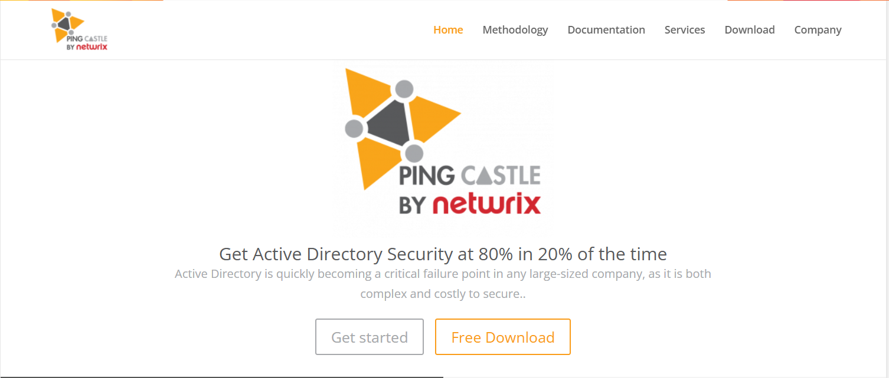
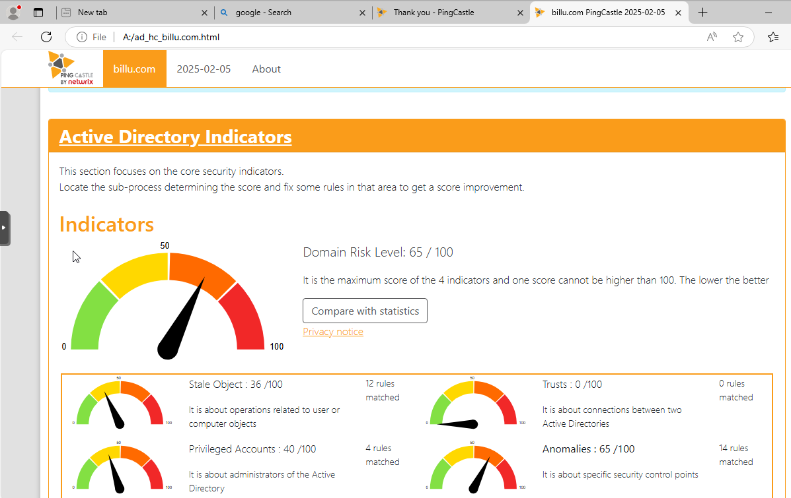
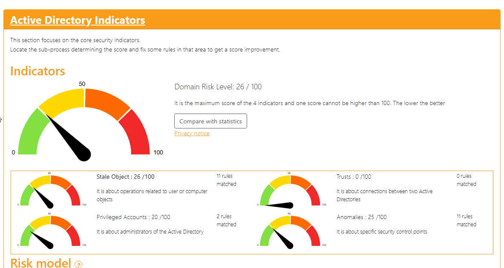

# TSSR-2409-P3-G1-BuildYourInfra-BillU

## 1 - PingCastle

Pour la réalisation de notre projet, il nous a été demandé de réaliser un audit. Nous avons choisi le logiciel PingCastle pour le mener à bien, 
Pour l'installation, il faut se rendre sur le site.https://www.pingcastle.com/

Cliquer sur FreeDownload

  

Un fois le fichier télécharger, le décompresser et lancer le fichier :

Suivez le script ouvert puis deux fichier vont être créé dans le même dossier ou cse trouve PingCastle

 

et suivez les indications et les solutions proposées pour corriger les erreurs dans votre infrastructure et faire baisser le score au maximum.

